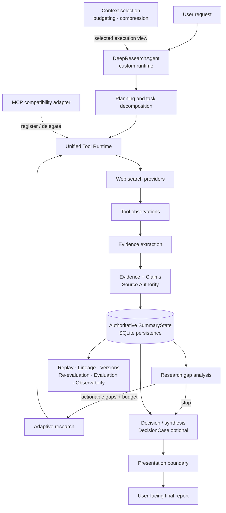

# Traceable Deep Research Agent

A production-oriented AI Agent system for evidence-grounded technical research
and decision support.

Unlike a conventional chatbot or single-pass RAG pipeline, it manages the full
research lifecycle:

```text
Planning → Tool Execution → Evidence → Gap Analysis → Adaptive Research
         → Decision State → Reporting → Replay
```

The project is primarily an **Agent Engineering** implementation: a custom
runtime coordinates tools, structured state, context, failure handling,
evaluation, and auditability. Technical decision intelligence is the main
application scenario and a useful stress test for those engineering boundaries;
it is not a claim that the project is a traditional optimization engine or a
human-level decision maker.

A normal chatbot is optimized to generate an answer. This system is optimized
to execute a complex research task while preserving what is known, unknown,
observed, inferred, and still missing.

> The LLM is a component of the system, not the system itself. Tool, search,
> and MCP results are observations—not decision truth.

## Architecture



The production path is the custom `DeepResearchAgent` runtime plus persistent
`SummaryState`. Web search is the registered tool used by the current research
pipeline. MCP is supported through a compatibility adapter that maps MCP tools
and results into the same runtime boundary; it is not presented as a separate
multi-agent system.

## Agent Lifecycle

For a technical selection task, one run follows this lifecycle:

1. Parse user requirements and identify whether a structured `DecisionCase`
   applies. Generic deep-research requests remain supported.
2. Extract candidates, criteria, hard constraints, and user-provided technical
   context when relevant.
3. Plan focused research tasks and execute searches through the unified tool
   runtime.
4. Normalize results into evidence and claims, retaining provenance and source
   authority.
5. Build the structured decision state and identify coverage gaps, unresolved
   constraints, risks, and unknowns.
6. Classify which gaps are externally actionable, generate follow-up queries,
   and continue only within research budgets and stopping rules.
7. Evaluate decision readiness without converting missing evidence into a
   negative result or forcing a recommendation.
8. Generate a user-facing report through a presentation boundary, then persist
   the run for replay and possible versioned re-evaluation.

This is a lifecycle rather than a feature checklist: each stage limits what the
next stage is allowed to treat as truth.

## Why Not Just RAG?

RAG remains part of the solution—the difference is the orchestration and state
around retrieval.

| Capability | Basic RAG pattern | This project |
|---|---|---|
| Retrieval | One fixed retrieval pass | Initial research plus bounded adaptive follow-ups |
| State | Primarily prompt/context | Persistent, structured `SummaryState` |
| Evidence | Retrieved chunks | Evidence, claims, provenance, and source authority |
| Missing information | Often implicit | Explicit research gaps and `UNKNOWN` states |
| Tools | Optional integration | Typed invocation/result boundary with traces |
| Recovery | Application-specific | Structured errors, bounded retries, circuit breaking, degradation |
| Audit | Final answer and logs | Replay, traces, lineage, versions, and evolution |
| Evaluation | Mostly answer-focused | Deterministic trajectory and grounding metrics |

The table describes engineering scope, not a claim that every RAG system is
simple or that this project outperforms other research products.

## Why a Custom Runtime?

The custom runtime was built to make the following boundaries explicit and
testable:

- lifecycle and deterministic routing;
- persistent state ownership;
- tool registration, invocation, and observation semantics;
- evidence and decision semantics;
- budgets, stopping, and failure handling;
- replay, versioning, evaluation, and context selection.

This gives the project fine-grained control and makes failure/state transitions
easy to inspect, at the cost of more implementation and maintenance work. An
optional LangGraph adapter maps the existing stages to State, Nodes,
Conditional Edges, and a checkpoint bridge. **LangGraph is a compatibility/demo
adapter, not the production runtime or source of truth.**

```bash
cd backend
uv sync --frozen --extra langgraph
PYTHONPATH=src:. uv run --no-sync python -m services.langgraph_demo
```

## Evidence Grounding

The core grounding flow is:

```text
Source → Evidence → Claim → Decision State
```

Retrieved content is first an observation. Evidence extraction records source
metadata and links claims back to supporting evidence before downstream
decision services consume them. Source authority recognition distinguishes
categories including official documentation, official security/pricing/release
notes, vendor material, independent technical analysis, independent benchmarks,
academic sources, and unknown sources.

Authority recognition is deterministic and heuristic; it is inspectable, but
not assumed to be infallible. The decision layer preserves three important
semantics:

- no evidence is not negative evidence;
- `UNKNOWN` is not `UNSATISFIED`;
- official or vendor evidence is not independent validation.

## Adaptive Research

A single search pass rarely covers every candidate/criterion pair or hard
constraint. After each decision-enrichment pass, the system evaluates current
coverage and unresolved gaps:

```text
Structured state
    → evidence coverage and unresolved gaps
    → gap classification and actionability
    → follow-up query generation
    → retrieval yield / information gain
    → research budget and stopping
```

The loop is bounded by explicit task, search, iteration, duration, token, or
cost fields where configured and observed. It also avoids duplicate queries and
previously executed gaps.

Crucially, **missing information is not always externally researchable
information**. User-provided facts such as team expertise belong to technical
context; they should not automatically become web-search gaps.

## Persistent State vs. Context

Persistent state and model context are deliberately separate:

```text
Persistent State = what the system has recorded as its structured truth
LLM Context      = the selected execution view for one model call
```

Context engineering selects named sections, applies a deterministic input
budget, and compresses optional oversized sections at stable boundaries.
Dropping or compressing a section changes only what that invocation sees; it
never deletes persisted evidence or rewrites decision state.

In other words, context engineering controls what the model sees, while prompt
instructions control what the model should do with that view.

## Reliability and Graceful Degradation

The runtime treats external providers as unreliable dependencies:

- request-scoped LLM preflight separates provider availability from process
  liveness;
- execution errors, including timeouts, are classified into structured error
  categories;
- explicitly recoverable/malformed cases use bounded retries;
- a per-run LLM circuit prevents repeated optional calls after terminal
  provider failure;
- tool and runtime failures are recorded with sanitized traces and notices;
- deterministic fallbacks preserve available state instead of inventing data.

One real provider failure mode is an OpenAI-compatible response with
`choices = None` or `choices = []`. The LLM wrapper validates response shape
before indexing it:

```text
malformed response → bounded retry → structured failure → graceful degradation
```

The runtime does not increase retries indefinitely, bypass provider validation,
or reinterpret failure as successful research.

## Reporting Boundary

Grounding and presentation have different audiences:

| Engineer-facing grounding/audit data | Decision-maker-facing report |
|---|---|
| Structured state, evidence, claims | Decision summary |
| Candidate/criterion/constraint IDs | Candidate comparison with display names |
| Decision IDs and source-of-truth rules | Hard-constraint status |
| Task summaries and execution traces | Key evidence, risks, and unknowns |
| Re-evaluation metadata | Conditions that should trigger re-evaluation |

The LLM may use authoritative structured state as private grounding context,
but the final report is validated for required presentation structure and
internal-state leakage. Invalid output is discarded and replaced by a
deterministic user-facing projection; it is not repaired with unsafe string
replacement.

```text
Report = decision-maker facing
Replay / Claims / Traces = engineer-facing
```

Generic deep-research reports keep a natural research structure. The stricter
technical-decision section contract applies only when a `DecisionCase` exists.

## Replay, Versioning, and Re-evaluation

SQLite stores the authoritative run state together with tasks, evidence,
claims, execution events, sanitized traces, decision data, and lineage. Replay
reads persisted data without rerunning external providers.

Re-evaluation starts from a historical state, assesses observed changes and
eligible work, and can persist the result as a child version while keeping the
parent immutable. Diff, attribution, lineage, and evolution endpoints make
changes inspectable. The project does not claim a complete distributed or
fine-grained incremental recomputation engine.

## Evaluation and Observability

The evaluation harness is deterministic rather than dependent on an LLM judge.
It covers run/final-answer completion, planning completion, required-tool
coverage, tool success, evidence presence, grounded and unsupported claims, and
recovery behavior. Regression comparison preserves unavailable measurements as
`UNKNOWN` instead of turning them into failures or zero scores.

Decision-specific services separately expose hard-constraint status and
decision readiness. Execution/tool traces provide trajectory evidence, while
runtime telemetry records model calls, tool calls, end-to-end and stage
latency, and provider-reported token usage.

Cost is calculated only when usage is complete and an exact trusted
provider/model pricing rule is configured. Otherwise cost remains unknown.

## Canonical Demo

The canonical scenario asks the Agent to choose a primary database for a
multi-tenant B2B SaaS system: PostgreSQL or MongoDB. Orders, billing, and
authorization require strong transaction consistency and complex queries; the
team already knows PostgreSQL, while future scale and concurrency require
horizontal-scaling analysis.

This is one demonstration scenario, not a database-specific implementation. It
exercises planning, evidence grounding, technical context, hard constraints,
adaptive research, conservative readiness, reporting, and replay.

An example release-verification run produced the following execution
statistics (provider- and query-dependent, **not a performance benchmark**):

| Run artifact | Count/result |
|---|---:|
| Research tasks | 11 |
| Web searches | 11 |
| Evidence items | 55 |
| Claims | 8 |
| Execution traces | 11 |
| Adaptive iterations | 2 |
| Decision readiness | `INSUFFICIENT_EVIDENCE` |
| Authoritative recommendation | None |
| Final report leakage markers | 0 |

Returning no recommendation was intentional. The remaining unknowns stayed
explicit rather than being converted into negative evidence or hidden to make
the answer look decisive.

See [the interview demo guide](docs/interview_demo.md) for a concise walkthrough
and suggested inspection points.

## Quick Start

### Prerequisites

- Python 3.10+ and [uv](https://docs.astral.sh/uv/)
- Node.js 22+ and npm
- an Ollama, LM Studio, or OpenAI-compatible LLM endpoint
- credentials only for the external LLM/search providers you select
- Docker with Compose support for the containerized path

### 1. Clone and configure

```bash
git clone https://github.com/to1246zh-s-star/traceable-deep-research-agent.git
cd traceable-deep-research-agent
```

For local development, copy `backend/.env.example` to `backend/.env` and edit
the selected provider settings. Never commit the resulting `.env` file.

```powershell
# PowerShell
Copy-Item backend/.env.example backend/.env
```

```bash
# bash
cp backend/.env.example backend/.env
```

For `LLM_PROVIDER=custom` (an OpenAI-compatible service, including compatible
ModelScope endpoints), configure `LLM_BASE_URL`, `LLM_MODEL_ID`, and
`LLM_API_KEY`. For search, set only the credential required by `SEARCH_API`;
DuckDuckGo does not require an API key.

### 2. Start locally

Backend, PowerShell:

```powershell
cd backend
uv sync --frozen
$env:PYTHONPATH="src;."
$env:PYTHONUTF8="1"  # avoids GBK stdout errors from provider integrations
uv run --no-sync uvicorn main:app --host 0.0.0.0 --port 8000
```

Backend, bash:

```bash
cd backend
uv sync --frozen
PYTHONPATH=src:. uv run --no-sync uvicorn main:app --host 0.0.0.0 --port 8000
```

Frontend, from a second terminal at the repository root:

```bash
cd frontend
npm ci
npm run dev
```

Open `http://localhost:6006`. Vite proxies `/api` to the backend on port 8000.

### 3. Or use Docker Compose

Reuse the configured backend env file explicitly; Compose does not implicitly
load `backend/.env`:

```bash
docker compose --env-file backend/.env up --build
```

The frontend is available at `http://localhost:6006`, the backend at
`http://localhost:8000`, and SQLite/notes persist in the named `research-data`
volume.

## Health Checks and API

- `GET /healthz` reports process liveness and does not call providers.
- `GET /readyz` validates configuration shape without a network probe.
- live LLM preflight is request-scoped, so a provider outage can reject a
  research request while the process remains healthy.

Minimal synchronous request:

```bash
curl -X POST http://localhost:8000/research \
  -H "Content-Type: application/json" \
  -d '{"topic":"Compare PostgreSQL and MongoDB for a transactional SaaS workload using reliable evidence."}'
```

| Endpoint | Purpose |
|---|---|
| `POST /research` | Run research and return the final response |
| `POST /research/stream` | Run research with SSE lifecycle events |
| `GET /research/{research_id}/replay` | Aggregate persisted tasks, evidence, decisions, and timeline |
| `GET /research/{research_id}/evidence` | List structured evidence |
| `GET /research/{research_id}/claims` | List grounded claims |
| `GET /research/{research_id}/traces` | List execution traces |
| `GET /research/{research_id}/lineage` | Read immutable lineage metadata |
| `GET /research/{research_id}/versions` | List a version chain |
| `GET /research/{research_id}/evolution` | Inspect branch-aware decision evolution |
| `POST /research/{research_id}/reevaluate` | Prepare or execute versioned re-evaluation |

## Configuration

The complete safe template is [`backend/.env.example`](backend/.env.example).
The main settings are:

| Area | Variables |
|---|---|
| LLM | `LLM_PROVIDER`, `LLM_BASE_URL`, `LLM_MODEL_ID`, `LLM_API_KEY` |
| Local LLM | `LOCAL_LLM`, `OLLAMA_BASE_URL`, `LMSTUDIO_BASE_URL` |
| Search | `SEARCH_API`, `TAVILY_API_KEY`, `PERPLEXITY_API_KEY`, `SEARXNG_URL` |
| Persistence | `RESEARCH_DB_PATH`, `NOTES_WORKSPACE`, `ENABLE_NOTES` |
| Runtime | `MAX_WEB_RESEARCH_LOOPS`, `MAX_CONCURRENT_RESEARCH_TASKS` |
| Optional cost | `LLM_PRICING_RULES_JSON` |
| Ports/build | `BACKEND_PORT`, `FRONTEND_PORT`, `VITE_API_BASE_URL` |

`LLM_API_KEY` is required only for `custom`; search keys are required only by
their selected backends. `/readyz` returns variable names in configuration
errors, never their values.

## Repository Structure

```text
backend/
  src/
    agent.py                 # custom production-path orchestrator
    main.py                  # FastAPI entrypoint and replay/version APIs
    models.py                # authoritative state and decision models
    services/                # tools, evidence, context, decisions, reliability
  eval/                      # deterministic evaluation cases/baseline example
  scripts/                   # evaluation runner
  tests/unit/                # backend regression suite
  Dockerfile

frontend/
  src/                       # Vue 3 + TypeScript research/replay UI
  Dockerfile
  nginx.conf

docs/
  interview_demo.md

compose.yaml
README.md
```

## Tests

```powershell
cd backend
$env:PYTHONPATH="src;."
uv run --no-sync pytest tests/unit -q
```

Current release snapshot: **1216 backend unit tests passing**. This is regression
coverage, not a guarantee of production correctness or provider availability.

## Technology

Python, FastAPI, Uvicorn, SQLite, HelloAgents, OpenAI-compatible LLM providers,
Tavily/DuckDuckGo/Perplexity/SearxNG search integration, MCP compatibility,
Vue 3, TypeScript, Vite, nginx, Docker Compose, and an optional LangGraph
compatibility adapter.

## Current Limitations

- SQLite and the in-process runtime target local/single-instance deployment;
  there is no distributed worker or queue architecture.
- The API currently has no application authentication or fine-grained
  user/tool authorization and should not be exposed directly to untrusted
  networks.
- Research quality and availability depend on external LLM/search providers and
  the content they return.
- Source-authority recognition is heuristic, and evidence extraction quality is
  limited by source and model quality.
- Adaptive semantic interpretation still depends on LLM output even though
  budgets, state transitions, and conservative fallbacks are deterministic.
- The project does not train a custom Agent model and includes no SFT/RLHF
  pipeline.
- LangGraph is a compatibility/demo adapter, not the production runtime.
- No UI screenshots are currently committed; the repository documents a real
  reproducible demo path instead of using generated screenshots.

## Focused Roadmap

- production database plus queue-backed/distributed task execution;
- authentication and stronger tool permission/security policies;
- broader evaluation datasets and retrieval/reranking experiments;
- human-in-the-loop review and approval workflows.

## Security Notes

External content is treated as untrusted observation data, not authorization.
Tool execution passes through declared runtime boundaries. Credentials belong
in ignored environment files; persisted traces are sanitized and should not
contain prompts, evidence bodies, or secrets.

Frontend-generated Markdown crosses an explicit rendering boundary:

```text
Final Report Markdown
→ marked.parse()
→ DOMPurify.sanitize()
→ v-html
```

This preserves readable report output while reducing the risk of rendering
unsafe generated HTML.

No top-level license file is currently included. Add one before redistributing
or accepting external contributions.
