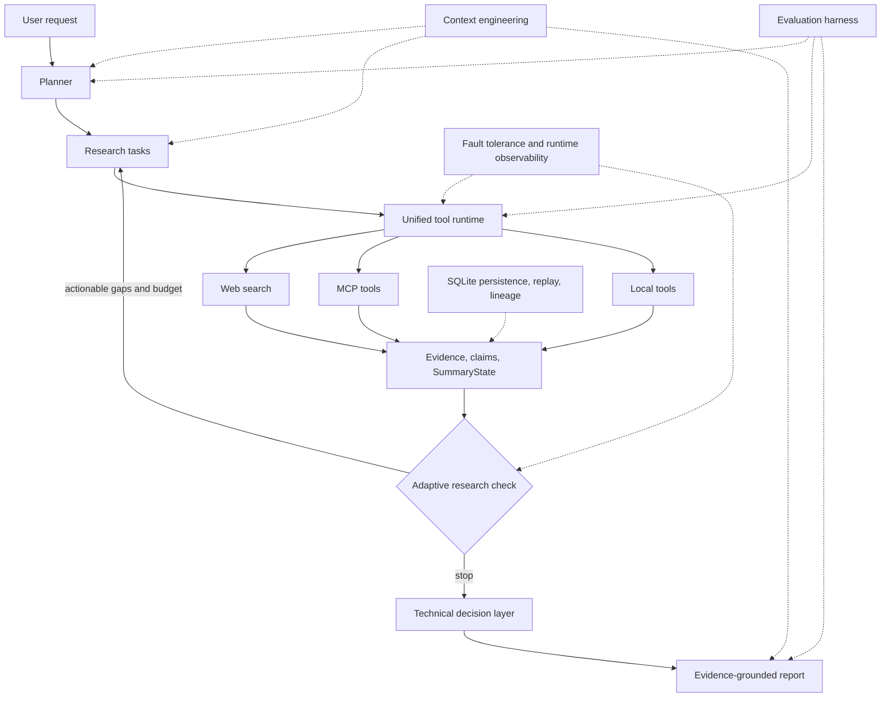

# Traceable Technical Research & Decision Agent

A production-oriented AI Agent for complex technical research and architecture
decisions. It decomposes a question, executes external tools, builds explicit
evidence and claim state, detects research gaps, adapts within deterministic
budgets, and persists the complete run for replay and versioned re-evaluation.

This is not just a chatbot around an LLM. The model is one component inside an
orchestrated system with persistent state, tool boundaries, stopping rules,
fault isolation, context engineering, evaluation, and operational telemetry.
The production source of truth is a custom runtime; an optional LangGraph layer
demonstrates framework compatibility without duplicating business state.

## Quick Start

```powershell
# Backend (PowerShell)
cd backend
uv sync
$env:PYTHONPATH="src;."
uv run uvicorn main:app --host 0.0.0.0 --port 8000
```

```bash
# Frontend (second terminal)
cd frontend
npm install
npm run dev
```

Open `http://localhost:6006`. Copy `backend/.env.example` to
`backend/.env` and replace only the placeholders needed by the selected LLM
and search providers.

```bash
# Containerized demo from the repository root
docker compose up --build
```

- Liveness: `GET http://localhost:8000/healthz`
- Configuration readiness: `GET http://localhost:8000/readyz`

## What This Demonstrates

| Project capability | Mainstream Agent engineering concept |
|---|---|
| Research planner | Planning and task decomposition |
| Unified tool runtime | Tool calling, MCP, external integration |
| `SummaryState` | Persistent Agent state |
| Adaptive research | Dynamic planning and bounded Agent loop |
| `ResearchBudget` and stopping decision | Execution budgets and deterministic routing |
| `ExecutionTrace` and runtime events | Observability and lifecycle tracing |
| LLM runtime circuit | Fault tolerance and graceful degradation |
| Replay and lineage | Debugging and auditability |
| Re-evaluation | Long-running, immutable, versioned Agent state |
| Context assembly, budgeting, compression | Context engineering |
| Evaluation harness | Deterministic Agent evaluation and regression checks |
| LangGraph adapter | Framework interoperability |
| Docker, Compose, health/readiness | Production deployment |

## Architecture



There is no fake multi-agent hierarchy here. `DeepResearchAgent` coordinates
specialized planning, summarization, decision-enrichment, and reporting
services around one authoritative `SummaryState`.

## Agent Lifecycle

1. Interpret the research or technical decision request.
2. Extract decision candidates, criteria, requirements, and constraints when
   the request represents a technical choice.
3. Generate focused research tasks.
4. Execute search, MCP, or local tools through the unified tool runtime.
5. Normalize observations into explicit evidence, claims, and provenance.
6. Assess coverage, unresolved constraints, evidence quality, and research
   gaps without converting missing evidence into a negative score.
7. Continue adaptive research only while deterministic stopping and budget
   rules permit it.
8. Build comparison, readiness, sensitivity, assumptions, and recommendation
   state using conservative decision semantics.
9. Generate the final report from selected, budgeted execution context.
10. Persist state, traces, lineage, and observability for replay and future
    re-evaluation.

Tool output is an observation, not automatically decision truth. Evidence must
pass through explicit normalization and assessment boundaries before it can
support a decision.

## Canonical Interview Demo

Use one realistic architecture question:

> We are designing a multi-tenant B2B SaaS platform. Choose PostgreSQL or
> MongoDB for the primary transactional store. We need strong tenant
> isolation, auditable financial updates, evolving customer-defined metadata,
> a small operations team, and deployment on managed cloud services. Compare
> both options, identify unresolved constraints, and make only the strongest
> recommendation supported by evidence.

This scenario naturally exercises planning, provider-backed retrieval,
candidate/criterion extraction, hard constraints, evidence provenance,
adaptive gap research, decision readiness, replay, and versioned
re-evaluation. During the demo, show:

1. generated research tasks and streaming tool events;
2. evidence and claims with source provenance;
3. research gaps and the adaptive stopping reason;
4. the decision artifact and whether the recommendation is definitive or
   provisional;
5. `/research/{research_id}/replay`, lineage, and a re-evaluation triggered by
   a new observed fact.

Expected artifacts include persisted `SummaryState`, evidence items, claims,
execution and tool traces, decision comparison/readiness, research gaps,
stopping explanation, report Markdown, runtime efficiency, and lineage.

See [docs/interview_demo.md](docs/interview_demo.md) for a 3–5 minute walkthrough
and concise answers to common interview questions.

## Design Principles

- The LLM is a component, not the final decision system.
- Tool results are observations, not truth.
- No evidence does not imply a bad score.
- `UNKNOWN` remains unknown; unresolved constraints are not false.
- Observability never becomes business truth.
- Context compression affects execution context and never mutates evidence.
- Historical decision versions remain immutable.
- Framework adapters reference, rather than replace, authoritative state.
- Provider failures degrade the affected operation where possible; they do not
  redefine process liveness or decision semantics.

## Persistence, Replay, and Re-evaluation

SQLite stores the authoritative `SummaryState`, evidence, claims, execution
history, decision state, sanitized traces, and lineage. Replay reconstructs an
inspectable run without rerunning providers. Re-evaluation deep-copies a
historical state and, when eligible work occurs, persists a new child version;
the historical version remains unchanged.

In Docker, `/data/research.db` and notes live on the named `research-data`
volume so state survives container replacement.

## Context, Reliability, and Observability

The context pipeline selects explicit sections, applies a deterministic input
budget, and boundary-aware compression before LLM execution. Compression is
observable and execution-only; persisted evidence is never replaced by its
compressed representation.

The runtime isolates tool failures, records sanitized traces, and opens a
per-run LLM circuit after provider failure so optional downstream enrichment
can degrade without inventing results. Run latency is one monotonic wall-clock
measurement, including correct parallel-task behavior.

Token usage comes only from provider metadata. Cost is calculated only when
usage is complete, provider/model identity is known, and an exact trusted
pricing rule is explicitly configured. Otherwise cost stays unknown.

## Evaluation and Quality

The deterministic evaluation harness measures completion, planning validity,
coverage, evidence/citation quality, unsupported claims, recovery behavior,
budget compliance, latency, token usage, and cost when known. Regression logic
preserves `UNKNOWN` instead of treating unavailable metrics as failures.

Current validation snapshot:

- 1,100+ backend unit tests;
- frontend TypeScript and Vite production build passing;
- deterministic deployment/configuration tests passing;
- Compose configuration included; Docker CLI was not available for the most
  recent local image build validation.

No accuracy or performance superiority over general-purpose research products
is claimed without comparative evaluation.

## LangGraph Compatibility

The custom runtime was implemented to explore orchestration mechanics and
already owns state, tools, budgets, stopping, replay, resilience, evaluation,
and decision semantics. The optional adapter maps these boundaries to
LangGraph State, Nodes, Conditional Edges, and Checkpoint concepts. It does not
create a second decision model or replace the production runtime.

```bash
cd backend
uv sync --extra langgraph
PYTHONPATH=src uv run python -m services.langgraph_demo
```

## Configuration and Operations

Requirements:

- Python 3.10+ and `uv`;
- Node.js 22+ and npm;
- provider credentials for the selected integrations;
- Docker with Compose support only for the containerized path.

Important environment variables are documented safely in
`backend/.env.example`:

- LLM: `LLM_PROVIDER`, `LLM_BASE_URL`, `LLM_MODEL_ID`, `LLM_API_KEY`;
- search: `SEARCH_API`, `TAVILY_API_KEY`, `PERPLEXITY_API_KEY`;
- persistence: `RESEARCH_DB_PATH`, `NOTES_WORKSPACE`;
- runtime: `MAX_WEB_RESEARCH_LOOPS`, `MAX_CONCURRENT_RESEARCH_TASKS`;
- optional cost rules: `LLM_PRICING_RULES_JSON`;
- deployment: `BACKEND_PORT`, `FRONTEND_PORT`, `VITE_API_BASE_URL`.

`.env` files, local databases, virtual environments, dependency directories,
and build caches are excluded from Git/container contexts. Startup logs include
safe provider/model metadata and sanitized endpoint origins, never credentials.

`/healthz` means the application process is alive and never calls an external
provider. `/readyz` checks configuration shape without network access. Live
LLM preflight remains request-scoped, so temporary external outages do not
make the process itself unhealthy.

### Common failure modes

- `/readyz` returns `503`: required configuration names are listed without
  echoing their values.
- A research request returns provider `503`: configuration is coherent, but
  request-scoped LLM preflight could not reach the provider.
- Search returns no results: the run records missing evidence/degradation; it
  does not infer a negative decision signal.
- Data disappears after a container is replaced: verify that the Compose
  `research-data` volume is mounted at `/data`.

## API Highlights

| Endpoint | Purpose |
|---|---|
| `GET /healthz` | Process liveness |
| `GET /readyz` | Non-network configuration readiness |
| `POST /research/stream` | Start research with SSE progress |
| `GET /research/{id}/replay` | Inspect persisted tasks, evidence, decisions, traces |
| `GET /research/{id}/lineage` | Inspect immutable provenance |
| `GET /research/{id}/versions` | List a version chain |
| `GET /research/{id}/evolution` | Inspect decision evolution |
| `POST /research/{id}/reevaluate` | Prepare/execute versioned re-evaluation |

## Repository Structure

```text
backend/
  src/
    agent.py                 # production orchestrator
    main.py                  # existing FastAPI entrypoint
    models.py                # authoritative state and decision models
    services/                # tools, retrieval, decisions, replay, evaluation
  tests/unit/
  Dockerfile

frontend/
  src/                       # Vue 3 + TypeScript UI
  Dockerfile
  nginx.conf

docs/
  interview_demo.md

compose.yaml
README.md
```

## Technology

Python, FastAPI, Uvicorn, SQLite, HelloAgents, OpenAI-compatible providers,
Tavily/DuckDuckGo/SearxNG integration, MCP compatibility, Vue 3, TypeScript,
Vite, nginx, Docker Compose, and optional LangGraph.

## Security Notes

External content is untrusted data. Retrieved text cannot authorize tool calls,
override system instructions, or expose credentials. Secrets stay in
environment variables and are excluded from persistence, sanitized runtime
traces, logs, and Git.

## Visual Assets

No screenshots are currently committed. A future demo capture should show the
streaming task view, evidence/replay view, and decision artifact; their absence
does not block the documented demo workflow.

## License and Acknowledgements

The repository is distributed under its selected project license and builds on
FastAPI, Vue, Vite, HelloAgents, and the configured external providers.
